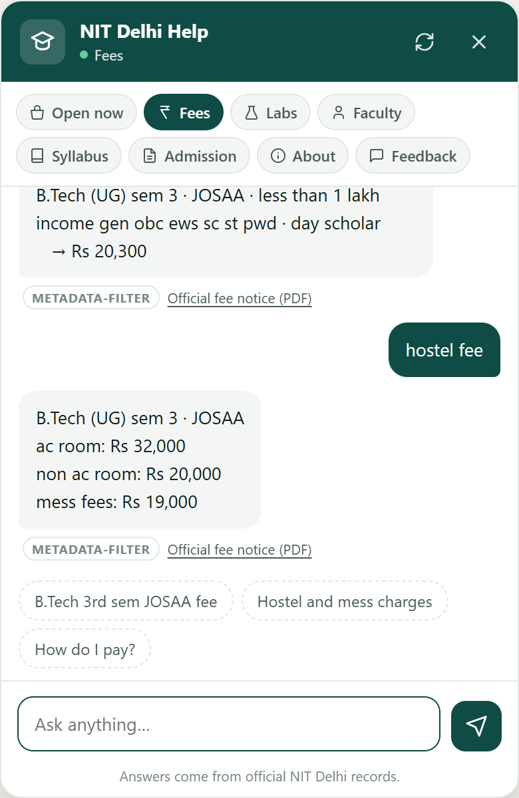
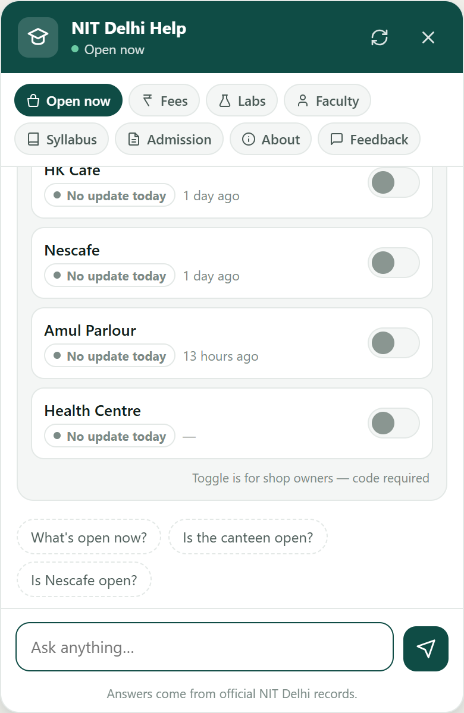
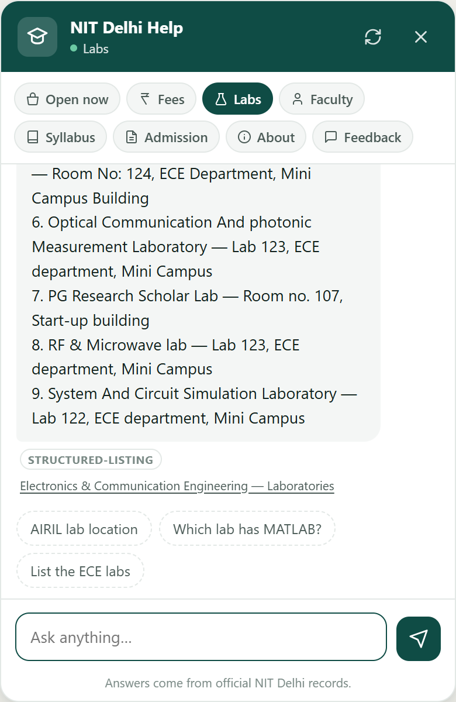
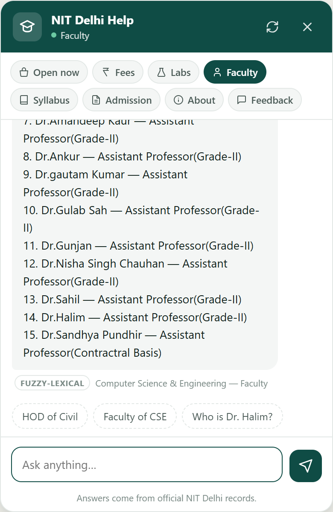
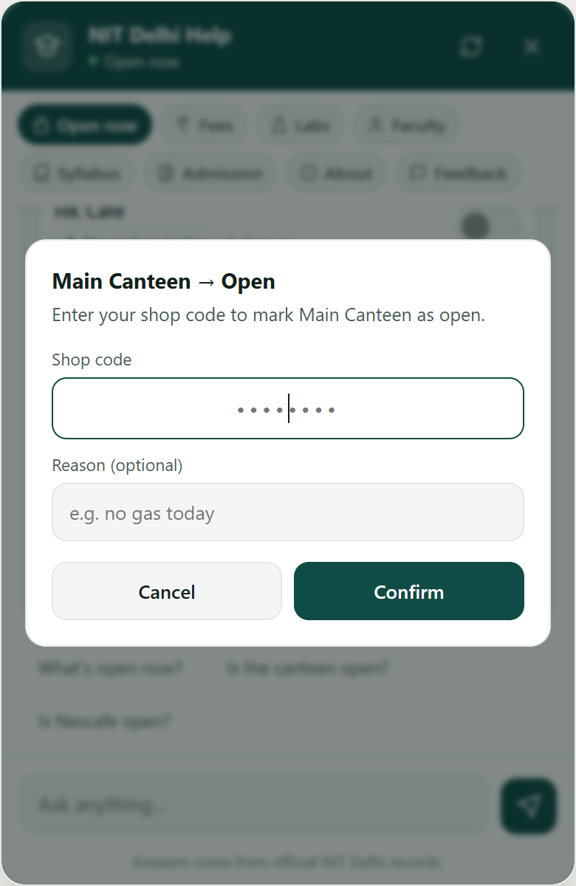
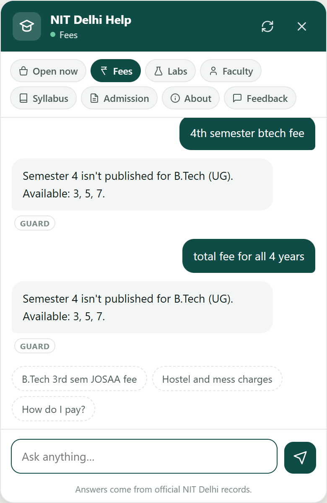

<div align="center">

# NIT Delhi Campus Bot

**A student help chatbot that refuses to guess.**
Fees, labs, faculty, syllabus, admissions and live campus shop status —
embedded as a widget on the college website.

</div>

---

## Live Link

> **Demo:** _not yet deployed_ — but `docker compose up` runs the whole stack locally,
> database and sample corpus included. See [Installation](#installation).
> The screenshots below are captured from the running application, not mockups.

---

## Demo

| Fees — exact figures, never computed | Live shop status |
|---|---|
|  |  |

| Labs — room numbers and rosters | Faculty — exact-match lookup |
|---|---|
|  |  |

| Shop owner toggle, code-gated | **Refusing to answer** — the important one |
|---|---|
|  |  |

The badge under every answer (`METADATA-FILTER`, `EXACT-LOOKUP`, `FUZZY-LEXICAL`,
`GUARD`, `HYBRID(BM25+VECTOR) + LLM`) shows which retrieval path produced it —
useful for debugging, and useful for trusting the answer.

---

## Project Overview

NIT Delhi students repeatedly ask the same questions — what's the fee for my
semester, where is that lab, who is the HOD, what documents do I bring to
reporting, is the canteen still open. The answers exist, scattered across PDFs,
department pages and notices nobody reads.

This is a chatbot for those questions. The design constraint that shaped
everything: **a wrong fee figure or a wrong room number is worse than no answer
at all.** A student who quotes a made-up fee to their parents, or walks to the
wrong building, stops trusting the bot permanently.

So most answers never reach a language model.

### The measurement that drove the architecture

Faculty records in the source data are near-identical sentences with one name
swapped:

```
"Dr.Sahil is a member of the CSE Department at NIT Delhi. Designation: Assistant Professor(Grade-II)."
"Dr.Halim is a member of the CSE Department at NIT Delhi. Designation: Assistant Professor(Grade-II)."
```

Measured pairwise text similarity between **different people**: mean 0.787,
top pairs **0.975**. An embedding model maps these to nearly the same vector, so
semantic search will confidently return the wrong professor. This is not a
tuning problem — the only distinguishing signal is a proper noun, which
embeddings compress away.

The same logic applies to room numbers and rupee amounts. Their meaning is
*exact*, not semantic.

**Conclusion: classify retrieval by behaviour, not by topic.**

| Class | Data | Technique | Vectors? | LLM? |
|---|---|---|---|---|
| Entity lookup | 76 faculty & staff | lexical + fuzzy, title-stripped | ✗ | ✗ |
| Exact lookup | 35 labs | room number → alias → equipment keyword | ✗ | ✗ |
| Parametric | 70 fee rows | metadata filtering → hybrid fallback | fallback only | ✗ |
| Whole document | 4 admission checklists | never chunked — a partial checklist is dangerous | ✗ | ✗ |
| Volatile | 5 campus outlets | direct read + freshness stamp, never cached | ✗ | ✗ |
| Semantic prose | 52 courses, dept pages | BM25 + dense, fused with RRF | ✓ | ✓ |

Roughly **80% of queries are answered with zero LLM calls**, from templates fed
by MongoDB. Running out of API quota degrades one category to raw source text
and leaves the rest untouched.

---

## Features

**Answers**
- Fee lookup by programme, semester, admission route, category and residence, with the source PDF linked
- Fee component breakdown — tuition, hostel, mess, caution money, bank details
- Lab lookup by room number, name, acronym, or equipment ("which lab has MATLAB")
- Faculty, staff and HOD lookup, tolerant of typos (`dr haleem` → Dr. Halim)
- Department rosters and lab rosters
- Syllabus: course listings per semester, module lists, and LLM-phrased explanations
- Full admission document checklists, rendered complete or not at all

**Refusals — deliberate, and tested**
- Semesters the institute hasn't published are refused, never interpolated
- Arithmetic is refused: no summing a degree, no computing differences
- Ambiguous names return every close match instead of silently picking one
- Near-miss lab names offer "did you mean" rather than a confident wrong room
- Unknown course codes are rejected before the model can invent module names
- Coverage statements are computed from the data, so they cannot go stale

**Live campus status**
- Five outlets with student-visible status and last-updated time
- Owners toggle from inside the chat with a per-person code
- Nightly reset boundary, evaluated lazily — no cron job to maintain

**Operations**
- Incremental corpus sync by content hash; unchanged records are never re-embedded
- Soft deletes — removed records stop being retrievable at once, stay recoverable
- Every threshold, prompt, lexicon and UI label is a database row, not a literal
- End-to-end tracing (LangSmith) covering the non-LLM paths too
- 22 regression tests and 30 adversarial tests

---

## Architecture Diagram

```
                                  User
                                    │
                                    ▼
                          Chat Widget  (vanilla JS)
                          8 category chips · no build step
                                    │
                                    ▼
                            FastAPI   /api/chat
                                    │
                                    ▼
                            Query Processor
                 typo tolerance · slot carry-over · pronoun resolution
                                    │
                                    ▼
                            Category Router
                       chip selection, or inferred from text
                                    │
            ┌───────────────────────┴───────────────────────┐
            │                                               │
            ▼                                               ▼
      EXACT PATHS                                    SEMANTIC PATH
   no vectors · no LLM                             syllabus · about
            │                                               │
            ▼                                               ▼
      Metadata Filter                               Scoped Prefilter
  program · semester · route                       programme + semester
  category · residence · room no                  applied BEFORE ranking
            │                                               │
            │                                               ▼
            │                                        Hybrid Retrieval
            │                                  ┌───────────────────────┐
            │                                  │  BM25      sparse     │
            │                                  │  Cosine    dense 384d │
            │                                  │  RRF       k = 60     │
            │                                  └───────────────────────┘
            │                                               │
            │                                               ▼
            │                                       Parent Expansion
            │                                        module → course
            │                                               │
            ▼                                               ▼
    ┌───────────────────────────────────────────────────────────────┐
    │                       MongoDB Atlas                           │
    │  fee_rows · chunks · fee_docs · admission_docs · shop_status  │
    │  config · ingest_log · shop_audit · feedback · link_only      │
    └───────────────────────────────────────────────────────────────┘
            │                                               │
            ▼                                               ▼
     Template Renderer                              Context Builder
   numbers copied verbatim                        capped at 2 500 chars
   nothing is generated                                     │
            │                                               ▼
            │                                     Groq · Llama 3.1 8B
            │                                        phrasing only
            │                                               │
            └───────────────────────┬───────────────────────┘
                                    ▼
                   Answer  +  Method Badge  +  Source Link
                                    │
                                    ▼
                                  User

   config collection ─────────────► thresholds · prompts · lexicon · UI
   (re-read every 60s, no redeploy)

   LangSmith ◄───────────────────── traces retrieval AND generation
```

### Ingestion

```
        Source files
   JSON · JSONL · scraped PDFs
              │
              ▼
         corpus.py
   build desired state, no DB writes
   content_hash on every record
              │
              ▼
          sync.py
   diff desired  vs  what is live
              │
   ┌──────────┼──────────┬───────────┐
   ▼          ▼          ▼           ▼
  NEW      CHANGED   UNCHANGED    MISSING
   │          │          │           │
   ▼          ▼          ▼           ▼
 embed     re-embed    touch      ARCHIVE
 locally   locally   last_verified  status="archived"
   │          │       no re-embed   not deleted
   └──────────┴──────────┴───────────┘
              │
              ▼
        MongoDB Atlas
              │
              ▼
         ingest_log
   who changed what, and when
```

---

## Retrieval Pipeline

```
                Query + category + carried slots
                              │
                              ▼
                         Route class
                              │
        ┌─────────────────────┴─────────────────────┐
        ▼                                           ▼
  STRUCTURED                                     PROSE
        │                                           │
        ▼                                           ▼
  Indexed find                              Prefilter by
  IXSCAN ~60 ms                          programme + semester
        │                                           │
        ▼                                           ▼
   How many rows?                          BM25  +  dense cosine
        │                                           │
   ┌────┼────┐                                      ▼
   │    │    │                                Fuse with RRF
   ▼    ▼    ▼                                      │
 one  many  none                                    ▼
   │    │    │                                Parent expansion
   │    │    │                                      │
   ▼    ▼    ▼                                      ▼
Answer Ask  REFUSE                          cosine ≥ 0.30 ?
       for  and state                          │        │
     missing real                             no       yes
      slot  coverage                           │        │
                                               ▼        ▼
                                            REFUSE    Groq
                                                    context-only
```

**Why prose retrieval is scoped before ranking.** Unscoped, *"units in AI 4th
semester"* returned **CSBB 252 — a Computer Science course**. Vector search
roamed the whole corpus and grabbed a semantically similar chunk from the wrong
programme. Filtering by programme and semester *before* ranking makes that
class of error impossible rather than unlikely.

**Multi-turn slots.** Fee and syllabus carry context across turns, and a query
naming a new programme + semester resets the rest — otherwise one bad turn
poisons the conversation:

```
you  btech 3rd sem josaa          bot  Which one? Tell me the residence.
you  day scholar below 1 lakh     bot  → Rs 20,300          [METADATA-FILTER]
you  hostel fee                   bot  ac 32,000 · non-ac 20,000 · mess 19,000
```

---

## Tech Stack

| Layer | Choice | Why |
|---|---|---|
| API | FastAPI + Uvicorn | async, typed request models |
| Database | MongoDB Atlas | corpus, vectors, config and live state in one place |
| Embeddings | `all-MiniLM-L6-v2` (sentence-transformers) | 384-dim, runs on CPU **on the host machine** — no third party sees student queries |
| Sparse retrieval | `rank_bm25` | exact course codes (`ADLB 101`) that vectors tokenise into noise |
| Fusion | Reciprocal Rank Fusion | rank-based, so BM25 and cosine scales need no calibration |
| Fuzzy matching | `rapidfuzz` | typo-tolerant names and lab aliases |
| LLM | Groq — Llama 3.1 8B Instant | prose phrasing only; fast and generous free tier |
| Auth | bcrypt + HMAC lookup | bcrypt is salted and unindexable, so HMAC provides the lookup key |
| Tracing | LangSmith | traces retrieval too, not just LLM calls |
| Frontend | Vanilla JS, no build step | one file, drops into any page with a script tag |

---

## Folder Structure

```
nitd-campus-bot/
├── app.py                 FastAPI — /api/chat, /api/shops, /api/config, /api/feedback
├── config.py              config loader (MongoDB-backed, per-key fallback)
├── db.py                  Mongo connection, shop status, rate limits, code hashing
├── corpus.py              builds desired corpus from sources — touches no database
├── sync.py                hash diff · incremental embed · soft delete · purge · restore
├── rag_core.py            retrieval: entity, lab, scoped hybrid, course matching
├── rag_fee.py             fee metadata filtering + hybrid fallback
├── rag_handlers.py        one handler per category + Groq client
├── tracing.py             LangSmith wiring; no-op if unavailable
├── seed_config.py         write default config into MongoDB
├── seed_shops.py          create outlets, issue owner codes (printed once)
├── static/index.html      the chat widget — no build step
├── tests/
│   ├── test_api.py        22 happy-path cases
│   └── stress_test.py     30 adversarial cases
└── docs/images/           README screenshots
```

**Collections:** `chunks` · `fee_rows` · `fee_docs` · `admission_docs` ·
`link_only` · `config` · `ingest_log` · `shops` · `shop_status` · `shop_staff` ·
`shop_audit` · `toggle_attempts` · `feedback`

`link_only` holds "not published yet" placeholders kept deliberately **out** of
retrieval. They are strong semantic matches for real questions — *"No detailed
content has been extracted for the Events section"* ranks first for "what events
are in CSE?" — and would otherwise be served to students as answers.

---

## Installation

### Option A — Docker (recommended, runs anywhere)

Nothing to install but Docker. No Python, no MongoDB, no API key.

```bash
git clone https://github.com/malothritesh07/nitd-campus-bot.git
cd nitd-campus-bot
docker compose up
```

Open <http://localhost:8000>.

Compose starts MongoDB, ingests the bundled sample corpus, creates the campus
outlets, and serves the app. The embedding model is baked into the image, so the
container needs no network at runtime and there is no first-query stall.

First build takes a few minutes (PyTorch CPU + the model). After that, start is
seconds.

To use a language model for the Syllabus category, add a free
[Groq](https://console.groq.com) key:

```bash
GROQ_API_KEY=gsk_... docker compose up
```

Without it every category still works — Syllabus returns the raw source extract
instead of an LLM summary.

### Option B — local Python

```bash
python -m venv .venv
source .venv/bin/activate          # Windows: .venv\Scriptsctivate
pip install -r requirements.txt

cp .env.example .env               # set MONGO_URI and SERVER_PEPPER
```

```bash
python seed_config.py              # defaults -> config collection
python sync.py                     # build corpus (downloads the model once, ~90 MB)
python seed_shops.py               # create outlets, prints owner codes ONCE
python -m uvicorn app:app --reload --port 8000
```

> Use forward slashes in `DATA_DIR`, even on Windows — backslashes get eaten by
> shell escaping.

> Set `SERVER_PEPPER` **before** issuing shop codes. Changing it later
> invalidates every code already handed out.

### The bundled data

`data/sample/` holds a reduced corpus so a clone has something to answer with —
187 chunks covering CSE and ECE departments, B.Tech fees, semesters 1–2 of two
programmes, and all four admission checklists. Every retrieval path is
exercised. It is public information already published on nitdelhi.ac.in.

The full corpus (440 chunks, six departments, all programmes) is produced by the
scrapers and is not committed. Point `DATA_DIR` at it to run against everything.

### Tests

Server must be running:

```bash
python tests/test_api.py      # 22/22 expected
python tests/stress_test.py   # 29/30 expected
```

### Corpus maintenance

```bash
python sync.py --dry-run       # preview changes, write nothing
python sync.py --status        # approved vs archived counts
python sync.py --restore <id>  # undo an archive
python sync.py --purge 30      # hard-delete archives older than 30 days
```

---

## Future Improvements

Ordered by value, not by ease.

1. **Cross-encoder reranking** — `bge-reranker-base` after first-pass retrieval. First-pass optimises recall; reranking optimises precision on the shortlist. The single biggest quality win still available.
2. **Golden dataset + RAGAS** — the 52 current tests are hand-written. Real evaluation needs retrieval metrics (recall@k, MRR) separated from generation metrics (faithfulness, context precision), because a bad answer could be either one's fault.
3. **Response streaming** — Syllabus takes ~4s and currently shows nothing until it completes.
4. **Query-log collection** — LangSmith traces exist, but there's no local record to mine for what students actually ask, which is the input to everything else.
5. **Approval workflow** — schema fields exist (`status`, `last_verified`); the reviewer UI does not. Needed before the college will let it self-update.
6. **Feedback loop** — thumbs up/down routed into the eval set rather than collected and ignored.
7. **Deploy** — Render/Railway free tier, then embed on the live college site.

---

## What I'd Highlight

- **Measured before designing.** The 0.975 similarity finding is why faculty lookup bypasses vector search. That number came from testing the data, not from a blog post.
- **Adversarial testing found real bugs.** `"vlsi lab room"` returned *UG Chemistry* because that lab's description mentions VLSI in passing; `"units in AI 4th semester"` returned a CSE course; a `--dry-run` caught 70 records about to be needlessly archived. All fixed, all documented in commit history.
- **Refusals are a feature.** Six of the thirty adversarial tests check that the bot *declines* — no invented semesters, no arithmetic, no guessing between two professors named Kumar.
